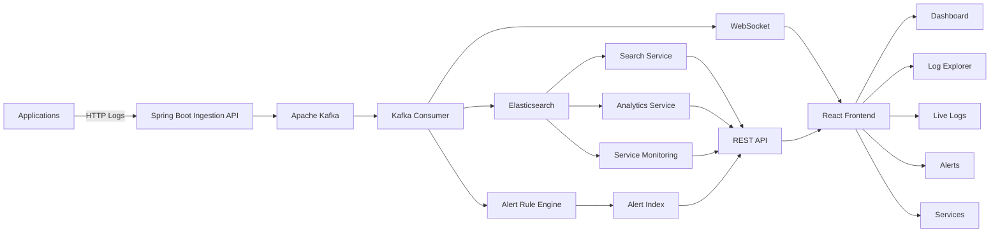

# LogPulse

### Real-Time Distributed Log Monitoring & Analytics Platform

LogPulse is a full-stack distributed log monitoring platform for collecting, processing, searching, analyzing, and monitoring application logs in real time.

It uses **Spring Boot, Apache Kafka, Elasticsearch, WebSockets, and React** to demonstrate a scalable event-driven architecture similar to the core concepts behind modern observability platforms.

---

## Overview

Modern applications often consist of multiple services producing large volumes of logs across different environments and hosts.

LogPulse provides a centralized system where application logs can be:

- Ingested through a REST API
- Published asynchronously through Apache Kafka
- Processed by Kafka consumers
- Indexed and searched using Elasticsearch
- Streamed to the browser using WebSockets
- Visualized through analytics dashboards
- Monitored through service health metrics
- Evaluated by rule-based alerting
- Investigated using advanced search and filtering

---

## Dashboard

<p align="center">
  
</p>

The dashboard provides a high-level view of the logging environment including:

- Total log volume
- Error count
- Warning count
- Active services
- Error rate
- Severity distribution
- Service activity
- Logs over time
- Recent application events

---

## System Architecture



### Log Processing Flow

```text
Application
    │
    │ POST /api/logs
    ▼
Spring Boot API
    │
    ▼
Apache Kafka
    │
    ▼
Kafka Consumer
    │
    ├──────────────► Elasticsearch
    │
    ├──────────────► WebSocket
    │
    └──────────────► Alert Rule Engine
                         │
                         ▼
                       Alerts
```

Kafka decouples log ingestion from downstream processing, allowing the ingestion API and log-processing pipeline to evolve independently.

---

## Features

### Centralized Log Ingestion

Applications can send structured logs through the LogPulse REST API.

Example:

```bash
curl -X POST http://localhost:8080/api/logs \
-H "Content-Type: application/json" \
-d '{
  "service":"payment-service",
  "level":"ERROR",
  "message":"Payment processing failed",
  "traceId":"trace-payment-1001",
  "environment":"production",
  "host":"payment-server-01"
}'
```

A log contains information such as:

```json
{
  "service":"payment-service",
  "level":"ERROR",
  "message":"Payment processing failed",
  "traceId":"trace-payment-1001",
  "environment":"production",
  "host":"payment-server-01"
}
```

---

### Kafka-Based Event Pipeline

Incoming logs are published to an Apache Kafka topic.

```text
Producer
   │
   ▼
log-events
   │
   ▼
Consumer
```

This separates ingestion from processing and provides the foundation for asynchronous, distributed log processing.

---

### Elasticsearch Storage & Search

Processed logs are indexed in Elasticsearch.

LogPulse supports filtering by:

- Service
- Severity
- Environment
- Message keyword
- Start time
- End time

Search results are paginated to avoid returning an unbounded number of log documents to the frontend.

---

## Log Explorer

<p align="center">
  
</p>

The Log Explorer provides an interface for investigating indexed application events.

Supported filters include:

```text
Keyword
Service
Severity
Environment
Time Range
```

Search results include:

```text
Timestamp
Severity
Service
Message
Environment
Host
Trace ID
```

Results are retrieved from Elasticsearch using server-side filtering, sorting, and pagination.

---

## Real-Time Log Streaming

<p align="center">
  
</p>

LogPulse streams processed logs to connected browsers through WebSockets.

```text
Kafka Consumer
      │
      ▼
Spring WebSocket
      │
      ▼
/topic/logs
      │
      ▼
React Live Logs
```

The Live Logs interface supports:

- Real-time event streaming
- Severity filtering
- Pause and resume
- Clearing the local stream
- Connection status
- Service and host visibility

---

## Analytics

LogPulse calculates monitoring statistics from indexed logs.

Examples include:

```text
Total Logs
Errors
Warnings
Active Services
Error Rate
Severity Distribution
Service Distribution
Logs Over Time
```

These metrics power the main monitoring dashboard.

---

## Alerting

<p align="center">
  
</p>

LogPulse includes a rule-based incident detection system.

One implemented rule monitors error frequency:

```text
5 ERROR/FATAL logs
from the same service
within 60 seconds
        │
        ▼
CRITICAL incident
```

Generated incidents contain rule metadata such as:

```text
Rule
Observed Count
Threshold
Window
Service
Severity
Status
Trace ID
Timestamp
```

### Incident Deduplication

LogPulse prevents repeated active incidents for the same service and rule.

```text
Threshold reached
       │
       ▼
Matching ACTIVE alert?
       │
   ┌───┴───┐
  YES      NO
   │        │
Suppress   Create
duplicate  incident
```

Once an incident is resolved, a future threshold violation can create a new incident.

---

## Service Health Monitoring

<p align="center">
  
</p>

LogPulse derives service-level health information from indexed logs.

Each service displays:

- Total logs
- Error count
- Warning count
- Error rate
- Last activity
- Current health status

Current demonstration health rules:

| Condition | Status |
|---|---|
| No recent activity | `INACTIVE` |
| Error rate >= 20% | `CRITICAL` |
| Error rate >= 10% | `DEGRADED` |
| Otherwise | `HEALTHY` |

These thresholds are application-defined monitoring rules for this project and can be made configurable in future versions.

---

## Tech Stack

### Backend

| Technology | Purpose |
|---|---|
| Java 17 | Backend language |
| Spring Boot | Application framework |
| Spring Web MVC | REST APIs |
| Spring Kafka | Kafka producer and consumer |
| Spring Data Elasticsearch | Elasticsearch integration |
| Spring WebSocket | Real-time communication |
| Jakarta Validation | API validation |
| Lombok | Boilerplate reduction |
| Maven | Build and dependency management |

### Data & Messaging

| Technology | Purpose |
|---|---|
| Apache Kafka | Asynchronous event streaming |
| Elasticsearch | Log indexing and search |

### Frontend

| Technology | Purpose |
|---|---|
| React | User interface |
| Vite | Frontend tooling |
| React Router | Client-side navigation |
| React Icons | Interface icons |
| WebSocket/STOMP | Live log updates |
| CSS | Responsive UI |

---

## Repository Structure

```text
logpulse/
│
├── backend/
│   ├── src/main/java/com/logpulse/
│   │   ├── config/
│   │   ├── controller/
│   │   ├── dto/
│   │   ├── exception/
│   │   ├── model/
│   │   ├── repository/
│   │   └── service/
│   │
│   ├── src/main/resources/
│   │   └── application.yml
│   │
│   └── pom.xml
│
├── frontend/
│   ├── src/
│   │   ├── api/
│   │   ├── components/
│   │   ├── pages/
│   │   ├── services/
│   │   ├── App.jsx
│   │   └── App.css
│   │
│   └── package.json
│
├── docs/
│   └── images/
│
└── README.md
```

---

## API Overview

### Ingest Log

```http
POST /api/logs
```

### Get Logs

```http
GET /api/logs
```

### Search Logs

```http
GET /api/logs/search
```

Example:

```text
/api/logs/search?service=payment-service&level=ERROR&page=0&size=25
```

### Analytics

```http
GET /api/analytics
```

### Services

```http
GET /api/services
```

### Alerts

```http
GET /api/alerts
```

### Active Alerts

```http
GET /api/alerts/active
```

### Resolve Alert

```http
PATCH /api/alerts/{id}/resolve
```

---

## Running Locally

### Prerequisites

Install:

```text
Java 17+
Node.js
npm
Apache Kafka
Elasticsearch
```

Verify Java:

```bash
java -version
```

Verify Node:

```bash
node --version
npm --version
```

---

### Start Infrastructure

Start Elasticsearch and Kafka using your local configuration.

Verify Elasticsearch:

```bash
curl http://localhost:9200
```

---

### Start Backend

```bash
cd backend
./mvnw spring-boot:run
```

Backend:

```text
http://localhost:8080
```

---

### Start Frontend

Open another terminal:

```bash
cd frontend
npm install
npm run dev
```

Vite will print the frontend development URL in the terminal.

---

## Example Test Data

Send an informational event:

```bash
curl -X POST http://localhost:8080/api/logs \
-H "Content-Type: application/json" \
-d '{
  "service":"auth-service",
  "level":"INFO",
  "message":"User authentication completed",
  "traceId":"trace-auth-1001",
  "environment":"production",
  "host":"auth-server-01"
}'
```

Send an error:

```bash
curl -X POST http://localhost:8080/api/logs \
-H "Content-Type: application/json" \
-d '{
  "service":"payment-service",
  "level":"ERROR",
  "message":"Payment gateway timeout",
  "traceId":"trace-payment-1002",
  "environment":"production",
  "host":"payment-server-01"
}'
```

The event flows through:

```text
REST API
   ↓
Kafka
   ↓
Consumer
   ↓
Elasticsearch
   ├──► Analytics
   ├──► Search
   ├──► Service Monitoring
   └──► Alert Detection

Consumer
   ↓
WebSocket
   ↓
Live Logs
```

---

## Design Decisions

### Why Kafka?

Kafka separates log ingestion from downstream processing.

Instead of performing storage, alert evaluation, and real-time delivery directly inside the HTTP request, LogPulse publishes the event and allows consumers to process it asynchronously.

### Why Elasticsearch?

Logs are search-oriented data.

Elasticsearch provides capabilities useful for this workload, including:

- Full-text search
- Structured filtering
- Time-based queries
- Sorting
- Pagination

### Why WebSockets?

Polling the backend repeatedly for new logs creates unnecessary requests.

WebSockets allow LogPulse to push newly processed events directly to connected clients.

### Why Server-Side Pagination?

A monitoring platform can accumulate large numbers of log events.

The Log Explorer therefore requests a limited page of results rather than loading the entire matching dataset into the browser.

---

## Current Architecture vs. Future Scale

The current implementation demonstrates the distributed architecture locally while remaining small enough to run as a portfolio project.

For larger workloads, the architecture can evolve toward:

```text
Multiple ingestion instances
        │
        ▼
Kafka partitions
        │
        ▼
Multiple consumer instances
        │
        ▼
Elasticsearch cluster
```

Additional production concerns would include authentication, authorization, retention policies, index lifecycle management, observability of LogPulse itself, TLS, secrets management, rate limiting, retries, dead-letter handling, and configurable alert rules.

---

## Roadmap

- [x] Spring Boot log ingestion API
- [x] Kafka producer
- [x] Kafka consumer
- [x] Elasticsearch persistence
- [x] Analytics API
- [x] React monitoring dashboard
- [x] Real-time WebSocket log streaming
- [x] Log Explorer
- [x] Advanced filtering
- [x] Search pagination
- [x] Rule-based alerts
- [x] Incident resolution
- [x] Alert deduplication
- [x] Service health monitoring
- [ ] Distributed trace exploration
- [ ] Automated backend tests
- [ ] Dockerized development environment
- [ ] Cloud deployment
- [ ] CI/CD pipeline
- [ ] Configurable alert rules

---

## Planned Cloud Architecture

LogPulse is being designed for cloud deployment while keeping infrastructure costs appropriate for a portfolio project.

A future deployment will separate:

```text
React Frontend
      │
      ▼
Spring Boot API
      │
      ▼
Kafka / Event Streaming
      │
      ▼
Elasticsearch
```

Cloud configuration and deployment instructions will be added after the local distributed system is finalized.

---

## Engineering Concepts Demonstrated

LogPulse is designed to demonstrate:

- Distributed systems
- Event-driven architecture
- Producer-consumer patterns
- Asynchronous processing
- REST API design
- Real-time communication
- Search infrastructure
- Server-side pagination
- Incident detection
- Alert deduplication
- Service health monitoring
- Full-stack application development
- Cloud-oriented system design

---

## Author

**Rachana Sudhakar**

Software Engineer focused on backend systems, distributed applications, full-stack development, and applied AI.
