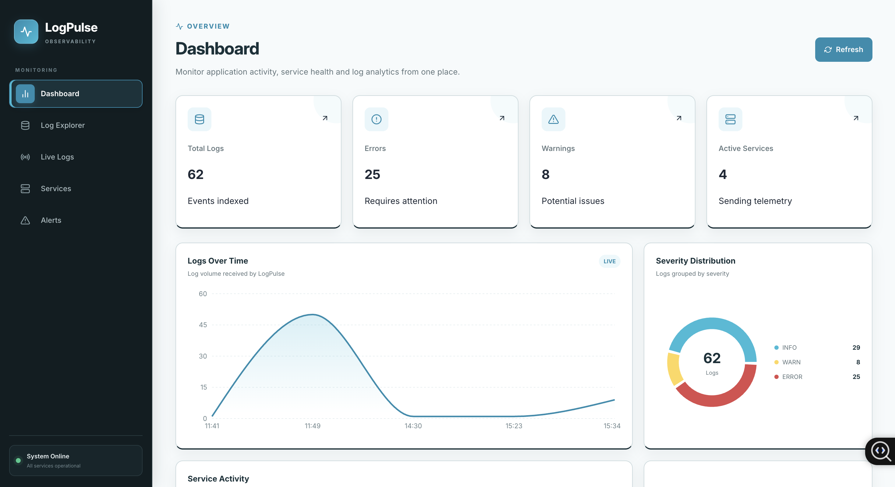
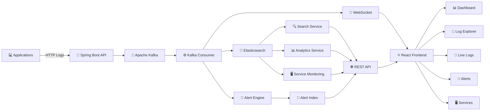
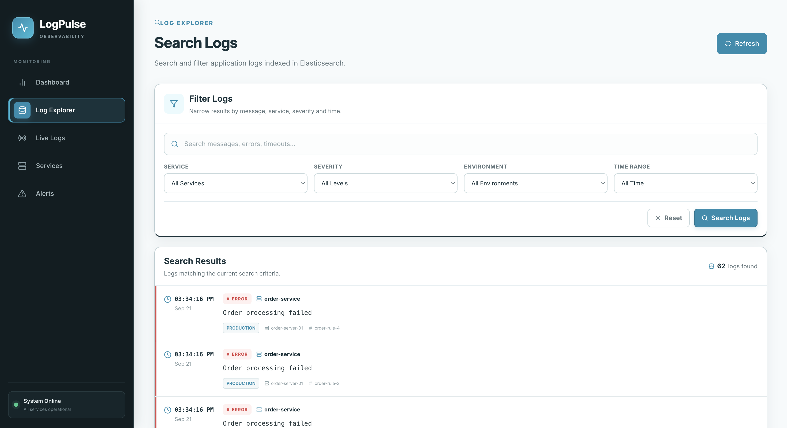
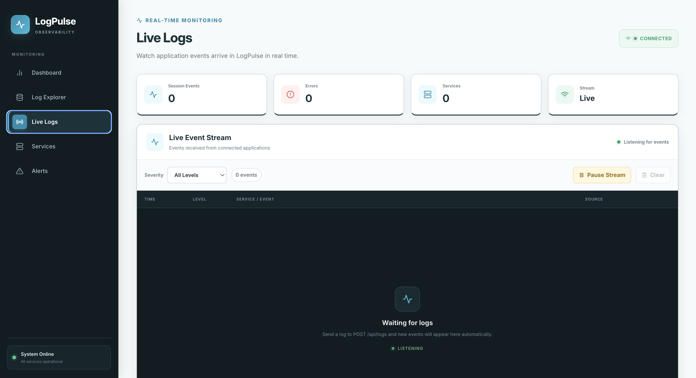
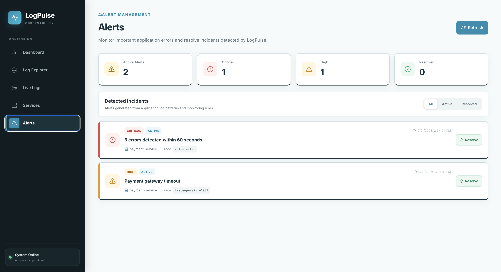
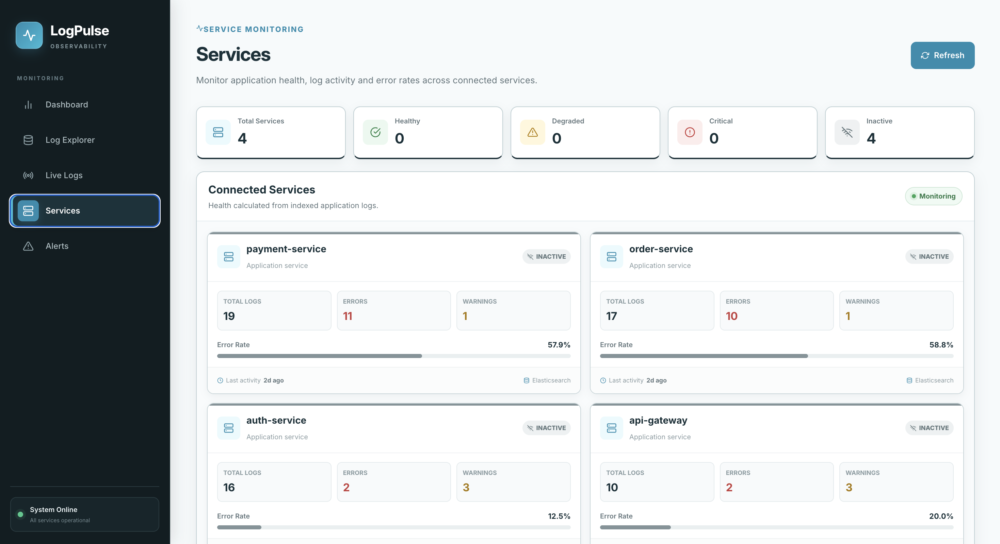

# 📊 LogPulse

### Real-Time Distributed Log Monitoring & Analytics Platform

<p align="center">
  <strong>Collect • Stream • Search • Analyze • Monitor • Alert</strong>
</p>

<p align="center">
  
  
  
  
  
  
</p>

---

## 🚀 Overview

**LogPulse** is a full-stack distributed log monitoring platform for collecting, processing, searching, analyzing, and monitoring application logs in real time.

It uses **Spring Boot, Apache Kafka, Elasticsearch, WebSockets, and React** to demonstrate an event-driven architecture inspired by modern observability and log-monitoring platforms.

Applications send structured logs to LogPulse, where they move through an asynchronous processing pipeline before being indexed, analyzed, monitored, and streamed to the frontend.

### ✨ What LogPulse Can Do

- 📥 Collect structured application logs through a REST API
- ⚡ Publish log events asynchronously through Apache Kafka
- 🔄 Process events using Kafka consumers
- 🔎 Index and search logs using Elasticsearch
- 📡 Stream incoming logs to the browser using WebSockets
- 📊 Display real-time monitoring analytics
- 🚨 Detect incidents using alert rules
- 🖥️ Monitor health across multiple application services
- 🔍 Search logs using multiple filters
- 📄 Paginate large Elasticsearch result sets
- 🧵 Correlate events using trace IDs

---

# 📸 Application Preview

## 📊 Monitoring Dashboard

<p align="center">
  
</p>

The dashboard provides a centralized overview of the logging environment.

It displays:

- 📚 Total logs
- 🔴 Error count
- 🟡 Warning count
- 🖥️ Active services
- 📈 Error rate
- 📊 Severity distribution
- ⚙️ Service activity
- 🕐 Logs over time
- 📝 Recent application events

---

# 🏗️ System Architecture



## 🔄 Log Processing Flow

```text
                     ┌─────────────────────┐
                     │    💻 Application   │
                     └──────────┬──────────┘
                                │
                         POST /api/logs
                                │
                                ▼
                     ┌─────────────────────┐
                     │ 🌱 Spring Boot API  │
                     └──────────┬──────────┘
                                │
                                ▼
                     ┌─────────────────────┐
                     │   📨 Apache Kafka   │
                     │     log-events      │
                     └──────────┬──────────┘
                                │
                                ▼
                     ┌─────────────────────┐
                     │ ⚙️ Kafka Consumer   │
                     └──────────┬──────────┘
                                │
                ┌───────────────┼───────────────┐
                │               │               │
                ▼               ▼               ▼
        ┌───────────────┐ ┌─────────────┐ ┌─────────────┐
        │🔎Elasticsearch│ │📡 WebSocket │ │🚨Alert Engine│
        └───────┬───────┘ └──────┬──────┘ └──────┬──────┘
                │                │               │
                ▼                ▼               ▼
          Search/Analytics   Live Logs        Incidents
```

Kafka decouples log ingestion from downstream processing so the ingestion API does not need to directly perform every storage, monitoring, and real-time operation.

---

# 🧩 Core Features

## 📥 Centralized Log Ingestion

Applications send structured logs through the LogPulse REST API.

### Endpoint

```http
POST /api/logs
```

### Example

```bash
curl -X POST http://localhost:8080/api/logs \
-H "Content-Type: application/json" \
-d '{
  "service":"payment-service",
  "level":"ERROR",
  "message":"Payment processing failed",
  "traceId":"trace-payment-1001",
  "environment":"production",
  "host":"payment-server-01"
}'
```

### 📝 Log Structure

A log can contain:

```json
{
  "service":"payment-service",
  "level":"ERROR",
  "message":"Payment processing failed",
  "traceId":"trace-payment-1001",
  "environment":"production",
  "host":"payment-server-01"
}
```

LogPulse adds and processes information such as the log ID and timestamp as the event moves through the system.

---

# 📨 Apache Kafka Event Pipeline

Incoming logs are published to a Kafka topic instead of being synchronously processed entirely inside the HTTP request.

```text
🌱 Spring Boot Producer
          │
          ▼
┌─────────────────────┐
│ 📨 Kafka            │
│                     │
│ Topic: log-events   │
└──────────┬──────────┘
           │
           ▼
⚙️ Log Consumer
```

### Why Kafka?

Kafka provides the foundation for:

- ⚡ Asynchronous processing
- 🔌 Producer-consumer decoupling
- 📈 Horizontal scaling
- 🔄 Event-driven workflows
- 🧩 Independent downstream processors

This means additional consumers can eventually be introduced without tightly coupling them to the ingestion API.

---

# 🔎 Elasticsearch Storage & Search

Processed logs are indexed in **Elasticsearch**.

Elasticsearch provides the search layer used by LogPulse for log investigation and analytics.

### Supported Filters

- 🔍 Message keyword
- 🖥️ Service
- 🚦 Severity
- 🌎 Environment
- 🕐 Start time
- 🕐 End time

Results are sorted and paginated on the backend so the frontend does not need to load an unbounded number of documents.

---

# 🔍 Log Explorer

<p align="center">
  
</p>

The Log Explorer provides an interface for investigating indexed application events.

### 🔎 Search Filters

```text
🔍 Keyword
🖥️ Service
🚦 Severity
🌎 Environment
🕐 Time Range
```

### 📋 Result Information

Each result can display:

```text
🕐 Timestamp
🚦 Severity
🖥️ Service
📝 Message
🌎 Environment
💻 Host
🧵 Trace ID
```

### 📄 Pagination

Search results use server-side pagination.

For example:

```text
Showing 1 - 25 of 187 logs

◀ Previous     Page 1 of 8     Next ▶
```

This prevents large search result sets from being loaded into the browser at once.

---

# 📡 Real-Time Log Streaming

<p align="center">
  
</p>

After a Kafka consumer processes an event, LogPulse can broadcast it to connected browsers using WebSockets.

```text
📨 Kafka
   │
   ▼
⚙️ Consumer
   │
   ▼
📡 Spring WebSocket
   │
   ▼
/topic/logs
   │
   ▼
⚛️ React
   │
   ▼
📟 Live Logs
```

### Live Logs Features

- 🟢 Connection status
- 📡 Real-time event streaming
- 🚦 Severity filtering
- ⏸️ Pause stream
- ▶️ Resume stream
- 🗑️ Clear local events
- 🖥️ Service visibility
- 💻 Host visibility

This allows new events to appear without repeatedly polling the REST API.

---

# 📊 Analytics

LogPulse calculates monitoring statistics from indexed logs.

### Current Metrics

| Metric | Description |
|---|---|
| 📚 **Total Logs** | Number of indexed log events |
| 🔴 **Errors** | Logs with error severity |
| 🟡 **Warnings** | Warning-level events |
| 🖥️ **Active Services** | Services represented in the logs |
| 📈 **Error Rate** | Percentage of logs classified as errors |
| 📊 **Severity Distribution** | Log count grouped by severity |
| ⚙️ **Service Distribution** | Activity grouped by service |
| 🕐 **Logs Over Time** | Log activity across time |

These metrics power the main monitoring dashboard.

---

# 🚨 Alerting & Incident Detection

<p align="center">
  
</p>

LogPulse includes a rule-based incident detection system.

One implemented rule monitors repeated error events.

```text
🔴 ERROR / FATAL
       │
       ▼
Same application service
       │
       ▼
5 events within 60 seconds
       │
       ▼
🚨 CRITICAL INCIDENT
```

### Incident Information

Generated alerts can contain:

- 🚨 Alert severity
- 🖥️ Service
- 📜 Rule
- 🔢 Observed count
- 🎯 Threshold
- ⏱️ Time window
- 🧵 Trace ID
- 🕐 Timestamp
- 📌 Incident status

---

## 🛡️ Alert Deduplication

LogPulse prevents repeated active incidents for the same service and rule.

```text
🚨 Threshold Reached
        │
        ▼
Matching ACTIVE alert?
        │
    ┌───┴───┐
    │       │
   YES      NO
    │       │
    ▼       ▼
Suppress   Create
Duplicate  Incident
```

Once an incident is resolved, a future threshold violation can create another incident.

---

# 🖥️ Service Health Monitoring

<p align="center">
  
</p>

The Services page provides a service-level view of application activity.

Each service displays:

- 📚 Total logs
- 🔴 Errors
- 🟡 Warnings
- 📈 Error rate
- 🕐 Last activity
- ❤️ Current health status

### ❤️ Health States

| Condition | Health |
|---|---|
| Normal error rate with recent activity | 🟢 `HEALTHY` |
| Error rate >= 10% | 🟡 `DEGRADED` |
| Error rate >= 20% | 🔴 `CRITICAL` |
| No recent activity | ⚫ `INACTIVE` |

> These are application-defined demonstration thresholds for the current version of LogPulse rather than universal production monitoring thresholds.

---

# 🧰 Technology Stack

## ☕ Backend

| Technology | Purpose |
|---|---|
| ☕ **Java 17** | Backend programming language |
| 🌱 **Spring Boot** | Backend application framework |
| 🌐 **Spring Web MVC** | REST API development |
| 📨 **Spring Kafka** | Kafka producer and consumer integration |
| 🔎 **Spring Data Elasticsearch** | Search and persistence |
| 📡 **Spring WebSocket** | Real-time browser communication |
| ✅ **Jakarta Validation** | Request validation |
| 🧹 **Lombok** | Boilerplate reduction |
| 📦 **Maven** | Build and dependency management |

## ⚙️ Data & Messaging

| Technology | Purpose |
|---|---|
| 📨 **Apache Kafka** | Asynchronous event streaming |
| 🔎 **Elasticsearch** | Log indexing and search |

## ⚛️ Frontend

| Technology | Purpose |
|---|---|
| ⚛️ **React** | User interface |
| ⚡ **Vite** | Frontend build tooling |
| 🧭 **React Router** | Client-side routing |
| 🎨 **React Icons** | Interface icons |
| 📡 **WebSocket / STOMP** | Real-time log updates |
| 💅 **CSS** | Responsive interface styling |

---

# 📁 Repository Structure

```text
logpulse/
│
├── ☕ backend/
│   ├── src/main/java/com/logpulse/
│   │   ├── config/
│   │   ├── controller/
│   │   ├── dto/
│   │   ├── exception/
│   │   ├── model/
│   │   ├── repository/
│   │   └── service/
│   │
│   ├── src/main/resources/
│   │   └── application.yml
│   │
│   └── pom.xml
│
├── ⚛️ frontend/
│   ├── src/
│   │   ├── api/
│   │   ├── components/
│   │   ├── pages/
│   │   ├── services/
│   │   ├── App.jsx
│   │   └── App.css
│   │
│   └── package.json
│
├── 📸 docs/
│   └── images/
│       ├── dashboard.png
│       ├── log-explorer.png
│       ├── live-logs.png
│       ├── alerts.png
│       └── services.png
│
└── README.md
```

---

# 🌐 API Overview

## 📥 Log Ingestion

```http
POST /api/logs
```

Accepts an application log and publishes it for processing.

---

## 📚 Retrieve Logs

```http
GET /api/logs
```

Returns stored logs used by parts of the monitoring interface.

---

## 🔍 Advanced Log Search

```http
GET /api/logs/search
```

Example:

```text
/api/logs/search?service=payment-service&level=ERROR&page=0&size=25
```

Supported query parameters include:

```text
service
level
environment
keyword
startTime
endTime
page
size
```

---

## 📊 Analytics

```http
GET /api/analytics
```

Returns aggregated monitoring statistics.

---

## 🖥️ Services

```http
GET /api/services
```

Returns calculated service health information.

---

## 🚨 Alerts

```http
GET /api/alerts
```

Returns generated incidents.

### Active Alerts

```http
GET /api/alerts/active
```

### Resolve Alert

```http
PATCH /api/alerts/{id}/resolve
```

---

# 💻 Running LogPulse Locally

## 📋 Prerequisites

Install:

```text
☕ Java 17+
🟢 Node.js
📦 npm
📨 Apache Kafka
🔎 Elasticsearch
```

Check Java:

```bash
java -version
```

Check Node:

```bash
node --version
npm --version
```

---

## 1️⃣ Start Infrastructure

Start Elasticsearch and Apache Kafka using your local configuration.

Verify Elasticsearch:

```bash
curl http://localhost:9200
```

You should receive information about the running Elasticsearch node.

---

## 2️⃣ Start the Backend

From the project root:

```bash
cd backend
./mvnw spring-boot:run
```

The backend runs at:

```text
http://localhost:8080
```

---

## 3️⃣ Start the Frontend

Open another terminal:

```bash
cd frontend
npm install
npm run dev
```

Vite will display the local frontend URL in the terminal.

---

# 🧪 Testing the Pipeline

## 🟢 Send an INFO Event

```bash
curl -X POST http://localhost:8080/api/logs \
-H "Content-Type: application/json" \
-d '{
  "service":"auth-service",
  "level":"INFO",
  "message":"User authentication completed",
  "traceId":"trace-auth-1001",
  "environment":"production",
  "host":"auth-server-01"
}'
```

## 🔴 Send an ERROR Event

```bash
curl -X POST http://localhost:8080/api/logs \
-H "Content-Type: application/json" \
-d '{
  "service":"payment-service",
  "level":"ERROR",
  "message":"Payment gateway timeout",
  "traceId":"trace-payment-1002",
  "environment":"production",
  "host":"payment-server-01"
}'
```

The event follows this pipeline:

```text
📱 Application
     │
     ▼
🌐 REST API
     │
     ▼
📨 Kafka
     │
     ▼
⚙️ Consumer
     │
     ├────────► 🔎 Elasticsearch
     │                │
     │                ├──► 🔍 Search
     │                ├──► 📊 Analytics
     │                └──► 🖥️ Service Monitoring
     │
     ├────────► 🚨 Alert Detection
     │
     └────────► 📡 WebSocket
                      │
                      ▼
                 📟 Live Logs
```

---

# 💡 Design Decisions

## 📨 Why Apache Kafka?

Without Kafka, the ingestion API could directly perform:

```text
HTTP Request
    │
    ├── Save Elasticsearch
    ├── Evaluate Alerts
    ├── Calculate Monitoring
    └── Broadcast WebSocket
```

That tightly couples ingestion to downstream processing.

LogPulse instead uses:

```text
HTTP Request
      │
      ▼
    Kafka
      │
      ▼
Consumers
```

This separates event ingestion from event processing and provides a foundation for additional consumers and horizontal scaling.

---

## 🔎 Why Elasticsearch?

Application logs are search-oriented data.

LogPulse needs to search across fields such as:

```text
message
service
severity
environment
timestamp
```

Elasticsearch provides useful capabilities for this workload including:

- 🔍 Full-text search
- 🎯 Structured filtering
- 🕐 Time-based queries
- ↕️ Sorting
- 📄 Pagination

---

## 📡 Why WebSockets?

Without WebSockets, the browser would need to repeatedly request:

```text
GET /api/logs
GET /api/logs
GET /api/logs
GET /api/logs
```

Instead:

```text
New Log
   │
   ▼
Backend
   │
   ▼
WebSocket
   │
   ▼
Browser
```

New events can be pushed directly to connected clients.

---

## 📄 Why Server-Side Pagination?

A monitoring system can eventually contain thousands or millions of log events.

Loading every matching document into React would not scale well.

LogPulse therefore uses:

```text
Browser
   │
   │ page=0&size=25
   ▼
Spring Boot
   │
   ▼
Elasticsearch
   │
   ▼
25 matching documents
```

Elasticsearch performs filtering, sorting, and pagination before results are returned.

---

# 📈 Scaling Strategy

The current implementation is designed to demonstrate the architecture locally while remaining practical as a portfolio project.

A larger deployment could evolve toward:

```text
                   ┌────────────────────┐
                   │   Load Balancer    │
                   └─────────┬──────────┘
                             │
              ┌──────────────┼──────────────┐
              ▼              ▼              ▼
          API Node 1     API Node 2     API Node N
              │              │              │
              └──────────────┼──────────────┘
                             ▼
                      📨 Kafka Cluster
                             │
              ┌──────────────┼──────────────┐
              ▼              ▼              ▼
          Consumer 1     Consumer 2     Consumer N
              │              │              │
              └──────────────┼──────────────┘
                             ▼
                   🔎 Elasticsearch Cluster
```

Additional production concerns would include:

- 🔐 Authentication and authorization
- 🔒 TLS
- 🔑 Secrets management
- 🚦 API rate limiting
- ♻️ Retry strategies
- ☠️ Dead-letter queues
- 🗃️ Log retention policies
- 🔎 Elasticsearch index lifecycle management
- 📊 Monitoring LogPulse itself
- ⚙️ Configurable alert rules
- 🧪 Automated testing
- 🔄 CI/CD

---

# ☁️ Planned Cloud Architecture

LogPulse is being designed for cloud deployment while keeping infrastructure costs appropriate for a portfolio project.

A cloud deployment can separate the major application layers:

```text
                    🌐 Internet
                         │
                         ▼
                 ⚛️ React Frontend
                         │
                         ▼
                  🌱 Spring Boot
                         │
                         ▼
                  📨 Event Stream
                         │
                         ▼
                  🔎 Elasticsearch
```

The cloud deployment will be added after the local distributed system is finalized.

Potential deployment areas include:

```text
Frontend hosting
Backend compute
Managed or containerized Kafka
Managed/search infrastructure
Container registry
Monitoring
CI/CD
```

The repository should only document specific cloud services after they are actually implemented.

---

# 🗺️ Project Roadmap

### ✅ Completed

- [x] 🌱 Spring Boot log ingestion API
- [x] 📨 Kafka producer
- [x] ⚙️ Kafka consumer
- [x] 🔎 Elasticsearch persistence
- [x] 📊 Analytics API
- [x] ⚛️ React monitoring dashboard
- [x] 📡 Real-time WebSocket streaming
- [x] 🔍 Log Explorer
- [x] 🎯 Advanced log filtering
- [x] 📄 Elasticsearch pagination
- [x] 🚨 Rule-based alerts
- [x] ✅ Incident resolution
- [x] 🛡️ Alert deduplication
- [x] 🖥️ Service health monitoring

### 🚧 Next

- [ ] 🧵 Distributed trace exploration
- [ ] 🧪 Backend unit and integration tests
- [ ] 🐳 Dockerized development environment
- [ ] ☁️ Cloud deployment
- [ ] 🔄 CI/CD pipeline
- [ ] ⚙️ Configurable alert rules
- [ ] 🔐 Authentication and authorization

---

# 🎯 Engineering Concepts Demonstrated

LogPulse demonstrates practical experience with:

```text
🏗️ Distributed Systems
⚡ Event-Driven Architecture
📨 Producer-Consumer Pattern
🔄 Asynchronous Processing
🌐 REST API Design
📡 Real-Time Communication
🔎 Search Infrastructure
📄 Server-Side Pagination
🚨 Incident Detection
🛡️ Alert Deduplication
🖥️ Service Health Monitoring
⚛️ Full-Stack Development
☁️ Cloud-Oriented System Design
```

---

# 🔮 Next Feature: Distributed Tracing

The next LogPulse feature will use the existing `traceId` field to correlate events generated by the same request across multiple services.

For example:

```text
🧵 trace-checkout-4821

12:20:01.120
🌐 api-gateway
│  Request received
│
▼
12:20:01.184
📦 order-service
│  Creating order
│
▼
12:20:01.291
💳 payment-service
│  Processing payment
│
▼
12:20:02.018
🔴 payment-service
│  Payment gateway timeout
│
▼
12:20:02.031
📦 order-service
   Order failed
```

This will allow LogPulse to move beyond individual log inspection and begin correlating activity across distributed services.

---

# 👩‍💻 Author

### Rachana Sudhakar

Software Engineer focused on:

- ☕ Backend Engineering
- 🏗️ Distributed Systems
- ⚛️ Full-Stack Development
- 🤖 Applied AI
- ☁️ Cloud Applications

---

<p align="center">
  <strong>📊 LogPulse</strong><br/>
  <sub>Real-Time Distributed Log Monitoring & Analytics</sub>
</p>